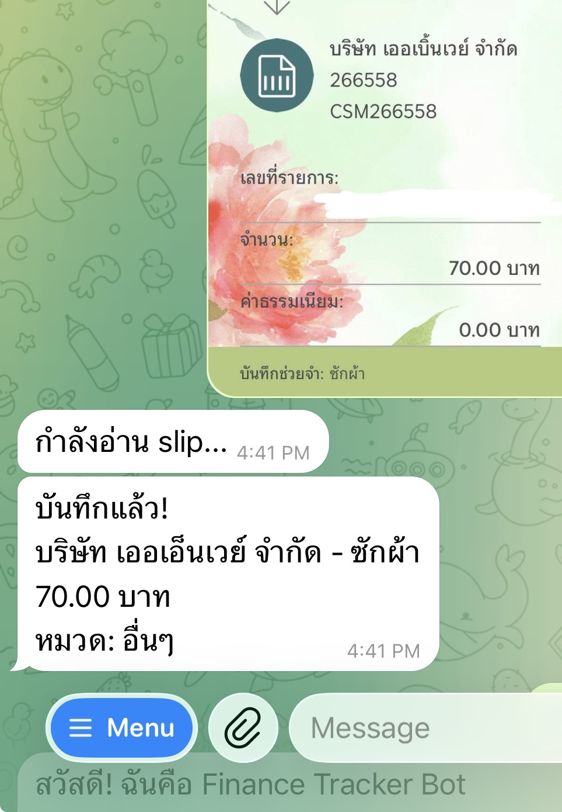
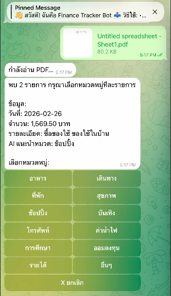
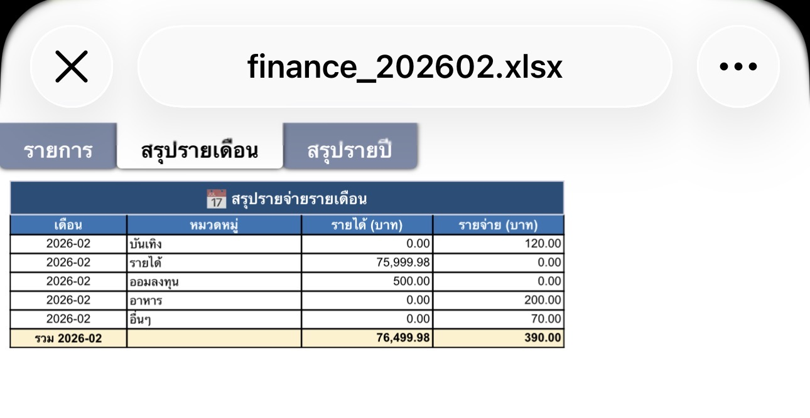
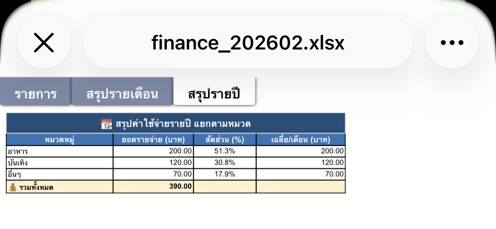
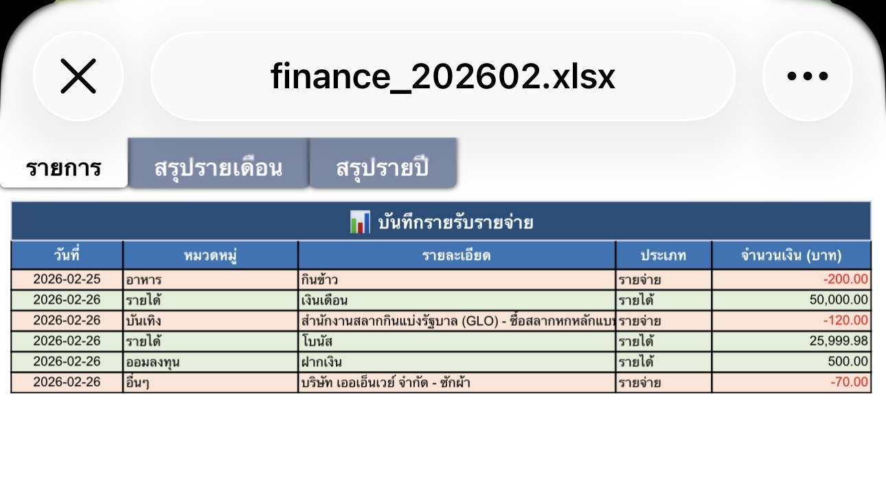
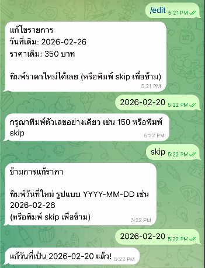
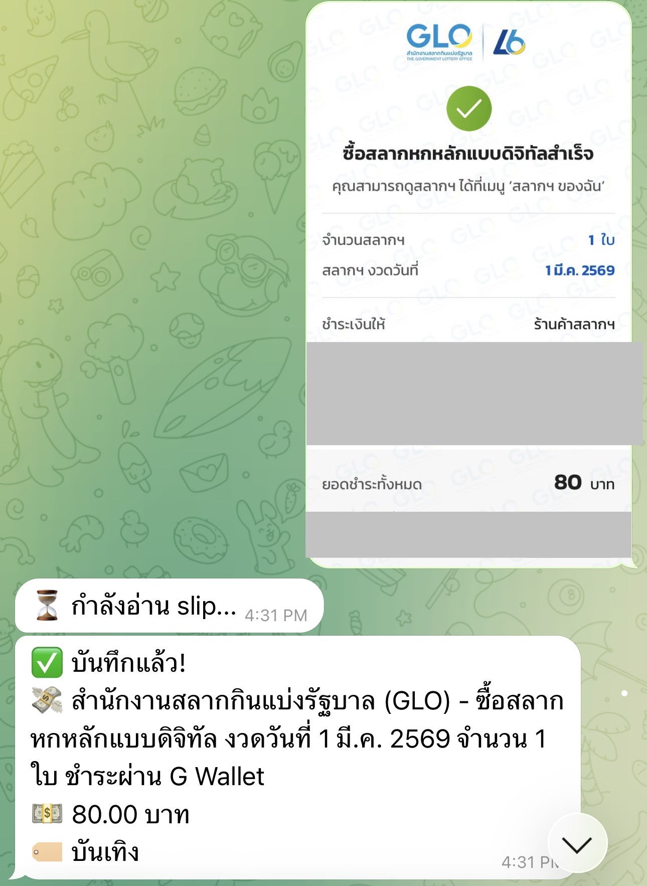

# 💰 Finance Tracker Bot

A Telegram bot that reads bank slips (images or PDFs) using Google Gemini AI, categorizes transactions automatically, and records everything into an Excel file with monthly and yearly summaries.

## 📸 Screenshots

### Sending a Bank Slip


### Reading a PDF with Multiple Transactions


### Monthly Summary


### Yearly Summary


### Transaction List


### Editing a Transaction


### Lottery Slip


### Expenses PDF
)

---

## ✨ Features

- 📸 **Slip Reader** — Send a photo or PDF of a bank slip; AI extracts the date, amount, and merchant automatically
- 📄 **Multi-item PDF** — If a PDF contains multiple transactions, the bot asks you to categorize each one in sequence
- ✍️ **Manual Entry** — Type transactions naturally, e.g. `coffee 80` or `salary 50000`
- 🏷️ **Auto-categorization** — Gemini suggests a spending category for every transaction
- 📅 **Smart Date Handling** — If no date is found in the document, today's date is used automatically
- 📊 **Monthly Summary** — `/summary` shows income vs. expenses broken down by category
- 📆 **Yearly Summary** — `/yearly` shows total annual spending with percentage breakdown per category
- 📋 **Transaction List** — `/list` shows the 10 most recent entries with one-tap delete
- ✏️ **Edit Amount & Date** — `/edit` lets you correct the amount and/or date of any recorded transaction
- 📥 **Excel Export** — `/export` sends the full `.xlsx` file with 3 sheets: Transactions, Monthly, and Yearly

## 🛠️ Tech Stack

| Component | Tool |
|-----------|------|
| Bot framework | [python-telegram-bot](https://github.com/python-telegram-bot/python-telegram-bot) v20 |
| AI / OCR | [Google Gemini 2.5 Flash](https://aistudio.google.com) |
| Spreadsheet | [openpyxl](https://openpyxl.readthedocs.io) |
| PDF parsing | [PyMuPDF (fitz)](https://pymupdf.readthedocs.io) |
| Runtime | Python 3.11+ |

## 📋 Prerequisites

- Python 3.11 or higher
- A [Telegram Bot Token](https://t.me/BotFather)
- A [Google Gemini API Key](https://aistudio.google.com/apikey) (free tier: 15 req/min)

## 🚀 Setup

**1. Clone the repository**
```bash
git clone https://github.com/YOUR_USERNAME/finance-tracker-bot.git
cd finance-tracker-bot
```

**2. Install dependencies**
```bash
pip3 install -r requirements.txt
```

**3. Configure environment variables**
```bash
cp .env.example .env
```
Open `.env` and fill in your keys:
```
TELEGRAM_TOKEN=123456789:ABCdef...
GEMINI_API_KEY=AIzaSy...
```

**4. Run the bot**
```bash
export $(cat .env | grep -v '#' | xargs) && python3 bot.py
```

## 🤖 Bot Commands

| Command | Description |
|---------|-------------|
| `/start` | Show welcome message and usage guide |
| `/list` | View 10 most recent transactions (with delete buttons) |
| `/edit` | Edit the amount and/or date of a recorded transaction |
| `/summary` | Monthly income vs. expense summary |
| `/yearly` | Yearly spending breakdown by category |
| `/export` | Download the Excel file |

**Or just send:**
- 📷 A photo of a bank slip
- 📄 A PDF with one or multiple transactions
- 💬 A text like `lunch 120` or `salary 50000`

## ✏️ How to Edit a Transaction

1. Type `/edit`
2. Tap the transaction you want to fix
3. Type the new amount (or `skip` to keep it)
4. Type the new date in `YYYY-MM-DD` format (or `skip` to keep it)

## 📁 Project Structure

```
finance-tracker-bot/
├── bot.py                      # Main bot logic and Telegram handlers
├── excel_manager.py            # Excel read/write and summary generation
├── requirements.txt            # Python dependencies
├── .env.example                # Environment variable template
├── .gitignore
├── README.md
├── example_slip.jpg            # Screenshot: bank slip
├── example_pdf.png             # Screenshot: PDF input
├── example_monthly_report.jpg  # Screenshot: monthly summary
├── example_yearly_report.jpg   # Screenshot: yearly summary
├── example_list_report.jpg     # Screenshot: transaction list
├── example_edit.png            # Screenshot: edit transaction
├── example_lottery_slip.jpg    # Screenshot: lottery slip
└── expenses.pdf                # Example pdf.file
```

## 📊 Excel Output

The exported `.xlsx` file contains three sheets:

- **Transactions** — Every recorded entry (date, category, description, type, amount)
- **Monthly Summary** — Income and expenses grouped by month and category
- **Yearly Summary** — Annual totals per category with percentage share and monthly average

## 💸 Cost

This project is **completely free** to run locally:

- Telegram Bot API — free, unlimited
- Google Gemini Flash — free tier: 15 requests/min, 1,500 requests/day
- No server required — runs on your own machine

## ⚠️ Notes

- The bot process must be running for it to receive messages. If you close the terminal, the bot stops.
- Never commit your `.env` file. It is already listed in `.gitignore`.
- All data is stored locally in `finance_tracker.xlsx`.
- If a PDF or image has no date, today's date is used automatically.

## 📄 License

This project is licensed under the **GNU General Public License v3.0 (GPL-3.0)**.

You are free to use, modify, and distribute this software, but any derivative work must also be released under the same GPL-3.0 license with its source code made publicly available.

See the [LICENSE](LICENSE) file or [https://www.gnu.org/licenses/gpl-3.0.html](https://www.gnu.org/licenses/gpl-3.0.html) for full details.
